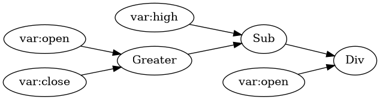
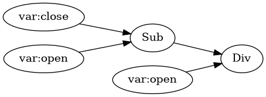
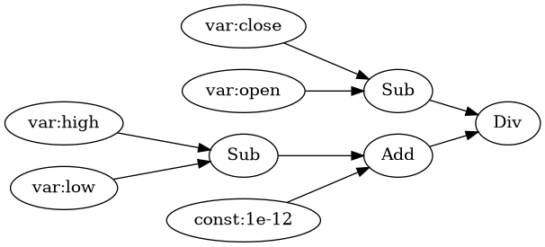

# 可导特征模块（Differentiable Feature Module）

本章讨论如何将 Alpha158 因子计算重构为端到端可训练的可导特征模块。核心困难并非来自网络结构，而是来自算子层：Alpha158 表达式中包含若干离散或非光滑算子（例如 `max/min`、硬比较、`rank`、`quantile`、`idxmax/idxmin` 等），它们在经典实现中会产生不可导或几乎处处为零的梯度，进而导致“原始数据 $\rightarrow$ 因子计算 $\rightarrow$ 下游模型”的梯度链路失效。

我们的总体策略遵循“问题 $\rightarrow$ 方法 $\rightarrow$ 理由 $\rightarrow$ 效果”的闭环。为保证因子语义与官方实现一致，我们在前向阶段使用硬算子；为恢复可用梯度信号，我们在反向阶段引入可微近似（BPDA）。在工程实现上，该策略被拆解为三个可独立验证的子模块：BPDA 基础算子（模块 1）、rolling 窗口与对齐底座（模块 2）、以及可在 GPU 上运行的 soft-rank/soft-sort（模块 3）。

---

## 1. 离散算子的反向可微近似（BPDA）

### 1.1 问题定义与因果链路

设原始输入为时间序列张量 $x$，因子计算模块为 $f(\cdot)$，下游模型为 $g(\cdot;\theta)$，优化目标为 $\mathcal{L}(g(f(x)); \theta)$。在标准自动微分框架下，若 $f$ 中包含离散算子（如硬比较、`argmax`），则其雅可比矩阵在几乎处处为零或不存在，导致

$$
\frac{\partial \mathcal{L}}{\partial x}
=
\frac{\partial \mathcal{L}}{\partial g}
\cdot
\frac{\partial g}{\partial f}
\cdot
\underbrace{\frac{\partial f}{\partial x}}_{\text{梯度阻断}}
\approx 0.
$$

这意味着：即使下游模型 $g$ 可导，整体梯度也会因 $f$ 中的离散算子而被“卡住”，从而无法联合优化上游特征构造过程。我们希望在不改变前向因子定义的前提下，使得反向传播能够穿过这些算子并输出稳定的梯度信号。

为此我们采用 BPDA（Backward Pass Differentiable Approximation）：前向阶段严格使用硬算子以对齐官方语义；反向阶段用光滑近似提供梯度，从而使 $\partial f/\partial x$ 不再退化。

### 1.2 BPDA 的统一形式

对任一离散算子 $h(\cdot)$，构造可微近似 $\tilde{h}(\cdot)$。BPDA 的实现可写为：

$$
y
=
\operatorname{BPDA}(h,\tilde{h})(u)
=
\operatorname{stopgrad}\!\big(h(u)-\tilde{h}(u)\big)
+ \tilde{h}(u).
$$

其中 $\operatorname{stopgrad}(\cdot)$ 表示在反向传播时将括号内项视作常数（在 PyTorch 中对应 `detach()`）。该构造带来如下性质：

- **前向**：$y = h(u)$（与官方离散算子严格一致）。
- **反向**：$\frac{\partial y}{\partial u} = \frac{\partial \tilde{h}(u)}{\partial u}$（用光滑近似提供梯度）。

因此，BPDA 将“语义对齐”与“可训练性”解耦：前向由硬算子 $h$ 决定、保持与官方一致；反向由软近似 $\tilde{h}$ 决定、提供连续梯度。

### 1.3 元素级 `Greater/Less`（逐元素 max/min）的 BPDA

在 Qlib Alpha158 中，`Greater(a,b)` 与 `Less(a,b)` 的语义分别为逐元素最大值与最小值：

$$
\texttt{Greater}(a,b)=\max(a,b), \qquad \texttt{Less}(a,b)=\min(a,b).
$$

这类算子在 $a=b$ 处不可导，在 $a\neq b$ 处梯度为分段常数（选择路径梯度），对学习而言常出现梯度稀疏与不稳定。我们采用基于 LogSumExp 的光滑近似：

$$
\widetilde{\max}_\tau(a,b)
=
\frac{1}{\tau}\log\Big(\exp(\tau a)+\exp(\tau b)\Big).
$$

$$
\widetilde{\min}_\tau(a,b)
=
-\widetilde{\max}_\tau(-a,-b).
$$

其中 $\tau>0$ 为“硬度/温度”参数：$\tau$ 越大，$\widetilde{\max}_\tau$ 越接近硬 $\max$，但梯度更尖锐；$\tau$ 越小，输出更平滑但偏离硬算子。

BPDA 形式为：

$$
\operatorname{Greater}_{\text{BPDA}}(a,b)
=
\operatorname{stopgrad}\!\big(\max(a,b)-\widetilde{\max}_\tau(a,b)\big)
+\widetilde{\max}_\tau(a,b).
$$

$$
\operatorname{Less}_{\text{BPDA}}(a,b)
=
\operatorname{stopgrad}\!\big(\min(a,b)-\widetilde{\min}_\tau(a,b)\big)
+\widetilde{\min}_\tau(a,b).
$$

**梯度解释**：对 $\widetilde{\max}_\tau$，其关于 $a,b$ 的梯度为二元 softmax 权重：

$$
\frac{\partial \widetilde{\max}_\tau}{\partial a}
=
\frac{\exp(\tau a)}{\exp(\tau a)+\exp(\tau b)},
\quad
\frac{\partial \widetilde{\max}_\tau}{\partial b}
=
\frac{\exp(\tau b)}{\exp(\tau a)+\exp(\tau b)}.
$$

因此 BPDA 反向传播会将梯度连续地分配给 $a$ 与 $b$，避免硬 $\max$ 的“winner-takes-all”式梯度骤变。

### 1.4 硬比较 `Gt/Lt` 的 BPDA（0/1 指示函数）

与 `Greater/Less` 不同，`Gt(a,b)`/`Lt(a,b)` 表示严格比较并输出布尔序列（在后续 rolling mean/sum 中被当作 0/1）：

$$
\texttt{Gt}(a,b)=\mathbb{I}[a>b], \qquad \texttt{Lt}(a,b)=\mathbb{I}[a<b].
$$

指示函数在几乎处处梯度为零，因此我们使用 sigmoid 近似其阶跃行为：

$$
\widetilde{\mathbb{I}}_{T}(a>b)
=
\sigma\!\left(\frac{a-b}{T}\right),
\qquad
\widetilde{\mathbb{I}}_{T}(a<b)
=
\sigma\!\left(\frac{b-a}{T}\right).
$$

其中 $T>0$ 为温度，$\sigma(\cdot)$ 为 sigmoid。BPDA 写为：

$$
\operatorname{Gt}_{\text{BPDA}}(a,b)
=
\operatorname{stopgrad}\!\Big(\mathbb{I}[a>b]-\sigma\!\left(\frac{a-b}{T}\right)\Big)
+\sigma\!\left(\frac{a-b}{T}\right).
$$

$$
\operatorname{Lt}_{\text{BPDA}}(a,b)
=
\operatorname{stopgrad}\!\Big(\mathbb{I}[a<b]-\sigma\!\left(\frac{b-a}{T}\right)\Big)
+\sigma\!\left(\frac{b-a}{T}\right).
$$

这种设计的动机是：前向保留 0/1 输出以与官方因子定义一致；反向使用 sigmoid 的非零导数
$\sigma'(z)=\sigma(z)(1-\sigma(z))$
提供梯度，从而使得比较型因子（例如上涨天数占比）在端到端训练时仍可向上游传播信号。

### 1.5 温度参数的默认选择与调参原则

温度参数（$\tau$ 或 $T$）决定了“语义对齐”与“梯度可用性”的权衡，其选择具有明确的因果影响：

- $\tau$ 或 $T$ 越小 $\Rightarrow$ 近似更平滑 $\Rightarrow$ 梯度更大、更密集 $\Rightarrow$ 训练更稳定；但前向近似偏离硬算子更明显（尽管 BPDA 前向仍用硬值，但反向梯度会更“软”）。
- $\tau$ 或 $T$ 越大（或越小，取决于具体形式）$\Rightarrow$ 近似更接近硬算子 $\Rightarrow$ 梯度更尖锐或更易饱和 $\Rightarrow$ 可能出现梯度消失（尤其是 sigmoid 近似在 $|a-b|\gg T$ 时饱和）。

结合模块级验证结果，我们采用如下默认值（可配置）：

- 元素级 `max/min`（`Greater/Less` 的可微近似）：$\tau=5.0$  
  选择理由：该取值在保持近似“较硬”的同时仍提供连续梯度分配；并且在测试中不同 $\tau\in\{1,5,10\}$ 的梯度范数变化不显著，$\tau=5$ 作为折中默认值更稳健。

- 硬比较 `Gt/Lt`：$T=0.2$  
  选择理由：在 $T=0.1$ 时 sigmoid 近似更接近硬比较，但更易饱和导致梯度极小；将温度提高到 $T=0.2$ 可显著提升梯度幅度并改善可训练性，同时仍保持合理的“硬比较”形态。该调整直接提升了 BPDA 反向传播的有效梯度信号。

> 实践建议：在不同数据尺度下应优先对输入做标准化/缩放（例如 z-score），再选取温度；并在小规模验证中扫描 $\tau/T$（例如 $\tau\in\{1,5,10\}$、$T\in\{0.05,0.1,0.2,0.5\}$）以确定“梯度不消失且训练不震荡”的区域。

---

后续章节将基于上述 BPDA 基础，扩展到 rolling `Max/Min`、`Rank`（百分位）、`Quantile`、`IdxMax/IdxMin` 等窗口算子，并给出与 Qlib Alpha158 表达式的一致性对齐与端到端梯度验证。

---

## 2. Rolling 窗口计算与时序对齐（Module 2）

Alpha158 的主体由窗口算子构成，例如 `Mean(x, N)`、`Std(x, N)`、`Max(x, N)` 等。若 rolling 的窗口定义、输出时间戳对齐或长度裁剪存在细小偏差，误差会在 158 个因子上被系统性放大，表现为数值错位、特征拼接失败或与官方实现难以对齐。模块 2 针对这一类“公共实现细节”做统一抽象，先把容易出错的部分变成可复用、可单测的基础组件。

具体而言，模块 2 需要解决两个直接影响正确性的工程问题：

1. **窗口抽取的一致性**：所有窗口算子必须共享同一滑动窗口定义，以避免 off-by-one 与隐式 shift。
2. **多窗口输出的对齐**：不同窗口大小 $N$ 导致输出长度不同，必须采用统一的裁剪/对齐策略，才能将多因子堆叠为同一特征张量。

为此，我们引入 rolling 工具层（Module 2），将“窗口化”和“对齐”作为显式步骤，并通过最小单元测试锁定其语义。

### 2.1 滑动窗口张量化（`unfold` 视图）

设输入序列为 $x \in \mathbb{R}^{B\times L}$，窗口长度为 $N$。我们将其转换为三维窗口张量：

$$
X = \operatorname{Unfold}(x; N) \in \mathbb{R}^{B \times (L-N+1) \times N}.
$$

其中第 $t$ 个窗口（从 0 开始计）为：

$$
X_{b,t,:} = \big[x_{b,t}, x_{b,t+1}, \ldots, x_{b,t+N-1}\big].
$$

我们使用 `Tensor.unfold` 来实现该窗口化，其原因是：它同时满足“语义清晰、实现复用、可微与可向量化”。

1. **算子复用**：所有 rolling 统计量都可表示为对窗口维度的归约，例如
$$
\operatorname{Mean}(x,N)_t = \frac{1}{N}\sum_{k=0}^{N-1} X_{t,k}, \quad
\operatorname{Sum}(x,N)_t = \sum_{k=0}^{N-1} X_{t,k}.
$$
2. **端到端可导**：`unfold` + `sum/mean/std/max/min` 等张量算子可直接纳入自动微分图（对 BPDA 版本的离散算子亦可共享该窗口张量）。
3. **GPU 友好**：窗口展开后可在 GPU 上进行批量向量化归约，避免 Python 循环的显著开销。

对应地，我们实现了 `rolling_sum/rolling_mean/rolling_std/rolling_max/rolling_min` 等基础函数，均通过“窗口张量 + 最后一维归约”完成。

### 2.2 不同窗口输出的右对齐裁剪（Right-Alignment）

窗口算子输出长度依赖 $N$。对长度为 $L$ 的序列，固定窗口 $N$ 的输出长度为 $L-N+1$；逐元素算子（如 `Log`、`Abs`）输出长度为 $L$。若直接拼接多个因子会出现长度不一致问题。

为使最终特征矩阵可堆叠为统一张量，我们采用“**右对齐裁剪**”策略：对一组张量 $\{y^{(i)}\}$，沿时间维裁剪到共同的最短长度 $L'=\min_i \operatorname{len}(y^{(i)})$，并保留尾部对齐：

$$
\operatorname{RightAlign}(y^{(i)}) = y^{(i)}_{:,\, \operatorname{len}(y^{(i)})-L' : \operatorname{len}(y^{(i)}) }.
$$

该策略成立的原因是：

- Alpha158 的 rolling 特征本质上是“截至当前时刻的过去窗口统计”；当不同特征的窗口长度不同，其可用的最早时刻不同。
- 右对齐裁剪保留所有特征**共同可用**的时间段，保证特征之间严格时间对齐，避免引入隐式 shift。

实现上我们提供 `right_align(*tensors)`，统一完成“取尾部 L'”的裁剪。

### 2.3 备注：与 `min_periods=1` 的关系

Qlib 官方 rolling 算子采用 `min_periods=1`（窗口不足时用更短窗口计算）。本模块（Module 2）先提供固定窗口 $N$ 的基础实现，因此输出长度为 $L-N+1$。若后续需要严格复现 `min_periods=1` 的早期时刻行为，可在该底座之上补充“前缀窗口/可变窗口”的逻辑或显式填充策略；而对主体训练流程而言，右对齐后的共同可用时间段更易验证，也更利于端到端训练的稳定性。

---

## 3. 基于 NeuralSort 的 Soft-Rank/Soft-Sort（Module 3）

`Rank/Quantile/IdxMax` 等窗口算子本质上依赖排序信息。在传统实现中，这类操作通常通过硬排序或基于 NumPy/SciPy 的实现完成，难以在 GPU 上高效运行，也难以提供稳定梯度。模块 3 的目标是给出一个**纯 PyTorch、GPU 友好**的 soft-sort 与 soft-rank，实现“可微排序”这一关键能力，并为后续窗口算子的 BPDA/可微近似提供统一组件。

我们采用 NeuralSort：通过构造软置换矩阵 $P(x)$ 近似硬置换，使排序与排名都可写成矩阵乘法形式。该设计的理由是：在 $N\le 60$ 的 Alpha158 窗口规模下，$O(N^2)$ 的构造成本可接受，同时避免引入外部依赖与 CPU 回退，从而提升工程可用性与训练稳定性。

### 3.1 Soft-Permutation 矩阵

设输入为 $x\in\mathbb{R}^{B\times N}$。NeuralSort 构造软置换矩阵 $P\in\mathbb{R}^{B\times N\times N}$，其第 $k$ 行表示“排序后第 $k$ 位由哪个元素贡献”的分布。我们采用如下形式：

$$
P(x) = \operatorname{softmax}\left(\frac{S(x)}{\tau}\right),
$$

其中 $\tau>0$ 为温度，$S(x)$ 为基于 pairwise 距离与排序位置构造的得分矩阵：

$$
S_{b,k,i} = (N+1-2k)\cdot s_{b,i} - \sum_{j=1}^{N} |s_{b,i}-s_{b,j}|,
$$

其中 $s=x$ 表示降序排序，$s=-x$ 表示升序排序。温度 $\tau$ 越小，$P$ 越接近硬置换矩阵；$\tau$ 越大，$P$ 越平滑，梯度更充分但排序语义更“软”。

### 3.2 Soft-Sort

软排序可表示为：

$$
\operatorname{soft\_sort}(x) = P(x)\,x.
$$

该形式对应“用 $P$ 将元素分配到排序位置”的直觉：soft-sort 输出的是排序位置上的期望值。当 $\tau \rightarrow 0$ 且元素无并列时，$P$ 逼近置换矩阵，soft-sort 收敛到硬排序。

**梯度特性**：soft-sort 的梯度包含两条路径：

$$
\frac{\partial \mathcal{L}}{\partial x}
=
P^\top \frac{\partial \mathcal{L}}{\partial y}
\;+\;
\left(\frac{\partial P}{\partial x}\right)^\top x.
$$

第一项是“直接路径”，即使 $P$ 近似硬排序仍接近常数；第二项来自 $P$ 对输入的依赖。因此在实践中，soft-sort 的梯度通常接近常数，仅出现轻微偏离。

### 3.3 Soft-Rank（百分位形式）

排名可由同一软置换矩阵获得。设位置向量 $k=[1,2,\ldots,N]$，则元素的软排名为：

$$
\operatorname{soft\_rank}(x) = P(x)^\top k.
$$

为了与 Qlib `Rank` 的百分位语义对齐，我们输出归一化百分位：

$$
\operatorname{soft\_rank\_pct}(x)
=
\frac{\operatorname{soft\_rank}(x)-1}{N-1}.
$$

**梯度特性**：soft-rank 的输出不显式包含 $x$，仅依赖 $P(x)$，因此其梯度完全由 $\partial P/\partial x$ 决定。当 $\tau$ 较小、$P$ 接近置换矩阵时，softmax 更易饱和导致梯度衰减；当 $\tau$ 增大，梯度增强但排序语义变软。因此在实践中常对 soft-rank 选择略大于 soft-sort 的温度，以换取更可用的梯度信号。

### 3.4 选择 NeuralSort 的原因

与依赖 CPU + SciPy 的 `fast_soft_sort` 相比，NeuralSort 的主要优势包括：

1. **纯 PyTorch 实现**：可直接在 GPU 上运行，避免 NumPy/CPU 回退。
2. **无额外依赖**：不依赖 SciPy 或自定义 CUDA 扩展。
3. **统一表达**：soft-sort 与 soft-rank 共享同一 $P(x)$，实现简洁且可扩展。

在 Alpha158 的场景中，窗口长度 $N\le 60$，NeuralSort 的 $O(N^2)$ 复杂度仍可接受，且能换取更稳定的训练流程与工程可用性。

---

## 4. Soft-Quantile 与 BPDA Quantile（Module 4）

### 4.1 问题：Quantile 的不可导性与尺度敏感性

Quantile 是 Alpha158 中一类关键窗口算子（例如 `Quantile($close, 20, 0.8)`）。硬 quantile 在数值上依赖排序的离散位置，导致梯度在几乎处处为 0；同时，金融时间序列往往具有显著的尺度变化，直接对原始数值进行 soft 近似会产生较大的尺度偏差与不稳定梯度。

因此，我们需要一种既可导、又能在不同尺度下保持稳定的 soft-quantile 近似，并与 BPDA 兼容。

### 4.2 方法：Soft-Sort + Soft-Pick

我们将 quantile 计算拆成两步：

1. **soft-sort**：对窗口内数据进行可微排序，得到近似排序序列 $x_{(1)}, \ldots, x_{(N)}$；  
2. **soft-pick**：对目标位置 $q\cdot(N-1)$ 附近做软选择，以高斯型权重进行加权平均。

具体实现如下：

$$
\tilde{x} = \operatorname{soft\_sort}(x), \qquad
w_k = \operatorname{softmax}\left(-\frac{(k - q(N-1))^2}{\beta}\right),
$$

$$
\operatorname{soft\_quantile}(x,q)=\sum_{k=0}^{N-1} w_k \tilde{x}_k.
$$

其中 $\beta$ 控制“选择”尖锐程度：$\beta$ 越小，权重越集中，结果越接近硬 quantile；$\beta$ 越大，结果越平滑，梯度更大。

### 4.3 尺度归一化与数值稳定性

为了减少尺度波动带来的梯度不稳定，我们在 soft-sort 之前对窗口值做标准化：

$$
z = \frac{x-\mu}{\sigma + \epsilon}.
$$

soft-quantile 在 $z$ 空间计算后再映射回原尺度，从而显著改善不同股票、不同价格区间下的数值稳定性。

### 4.4 BPDA 形式与效果

soft-quantile 提供连续梯度，但前向可能与官方 quantile 存在偏差。为保持前向语义严格一致，我们采用 BPDA：

$$
\operatorname{Quantile}_{\text{BPDA}}(x)
=
\operatorname{stopgrad}(\operatorname{Quantile}(x)-\operatorname{soft\_quantile}(x))
+ \operatorname{soft\_quantile}(x).
$$

这样，前向输出仍为硬 quantile，而反向梯度由 soft-quantile 提供。模块级验证表明：在中位数（$q=0.5$）附近 soft-quantile 与硬值几乎一致，在高/低分位数处存在可控偏差，同时梯度稳定且非零。

---

## 5. IdxMax / IdxMin 的 BPDA（Module 5）

### 5.1 问题：索引型算子不可导且带 1-based 语义

Qlib 中的 `IdxMax/IdxMin` 返回窗口内极值所在位置（**1-based**，即 `argmax()+1` / `argmin()+1`）。该算子是典型的离散索引操作，前向结果是整数位置，反向在几乎处处为零。若直接用于端到端训练，会导致梯度完全阻断。

因此，我们需要一种既保留 1-based 前向语义、又可在反向提供连续梯度的近似方法。

### 5.2 方法：硬索引前向 + soft one-hot 反向

我们采用 BPDA 思路：前向使用硬 `argmax/argmin` 计算索引，反向使用 softmax 权重构造一个“连续索引”。具体地，对输入 $x\in\mathbb{R}^{N}$：

1. **硬索引**：
$$
i^* = \arg\max(x), \quad \text{IdxMax}(x)= i^* + 1,
$$
其中 $+1$ 确保与 Qlib 的 1-based 语义一致。

2. **软 one-hot 权重**：
$$
w = \operatorname{softmax}(x/\tau),
$$

3. **连续索引**：
$$
\tilde{i} = \sum_{k=1}^{N} k\cdot w_k.
$$

最终的 BPDA 形式为：

$$
\operatorname{IdxMax}_{\text{BPDA}}(x)
=
\operatorname{stopgrad}((i^*+1)-\tilde{i}) + \tilde{i}.
$$

`IdxMin` 可通过对 $-x$ 复用上述流程。

### 5.3 结果与效果

该设计的效果是：

- **前向**：输出与 Qlib 完全一致（1-based 整数索引）。  
- **反向**：梯度通过 softmax 权重分配到所有输入元素，梯度密度可调（由温度 $\tau$ 控制）。  

模块级验证显示：`IdxMax/IdxMin` 在前向索引完全正确的同时，反向梯度非零且方向稳定，适合在后续端到端训练中使用。

---

## 6. 回归类 rolling 算子（Module 6）

### 6.1 问题：Slope / Rsquare / Resi / Corr 的窗口回归语义

Alpha158 中包含多种“基于时间索引的滚动回归”算子：`Slope`、`Rsquare`、`Resi` 以及与成交量相关的 `Corr`。在 Qlib 中，这些算子通过 Cython 优化实现，但在可导 PyTorch 重构中，我们需要一个**语义清晰且可微**的实现，同时保证与官方公式一致。

### 6.2 方法：窗口内解析解

对每个窗口 $x_{t-N+1:t}$，我们在时间索引 $t=1,\ldots,N$ 上拟合一元线性回归。其解析形式为：

$$
\text{slope} = \frac{\sum (t-\bar t)(x-\bar x)}{\sum (t-\bar t)^2},
$$

$$
R^2 = \frac{\left(\sum (t-\bar t)(x-\bar x)\right)^2}{\sum (t-\bar t)^2\cdot \sum (x-\bar x)^2}.
$$

残差采用“**最后一个时刻**”的拟合误差：

$$
\text{resi} = x_t - (a + b t), \quad a=\bar x - b\bar t.
$$

相关系数则采用标准协方差归一化：

$$
\text{corr}(x,y)=\frac{\sum (x-\bar x)(y-\bar y)}{\sqrt{\sum (x-\bar x)^2}\,\sqrt{\sum (y-\bar y)^2}}.
$$

所有公式均在窗口张量上向量化实现，避免 Python 循环，并保持与 Qlib 语义一致。

### 6.3 数值稳定与梯度特性

这些回归算子在“方差为 0”或“完全线性相关”时会出现梯度衰减或退化，这与统计量本身的性质一致。为避免除零，我们在分母中加入 $\epsilon$，确保计算稳定。模块级验证表明：

- 在一般序列下梯度非零且可回传；  
- 在完全相关/反相关序列下梯度为零，符合统计量的解析性质。  

因此，该实现兼顾了数值稳定性与统计语义一致性，适合作为后续因子表达式的底层算子。

---

## 7. 表达式解析与模板化计算图（Module 7）

### 7.1 问题：158 个表达式的可维护性与一致性

Alpha158 包含 158 条表达式，许多仅在窗口参数或分位参数上不同。如果逐条手写计算图，不仅成本高，而且容易引入细微语义偏差，导致与 Qlib 不一致。我们需要一种**自动化且可复现**的表达式解析机制，并且能够将“同构表达式”汇聚为少量模板，便于后续实例化与维护。

### 7.2 方法：AST 解析 + 模板化 DAG

我们将 `alpha158_name_expression.csv` 中的表达式解析为抽象语法树（AST），并进一步构建为 DAG 形式的计算图。不同表达式若其算子结构一致、仅参数不同（如窗口 $N$、分位 $q$），则归并为同一模板；参数值则存储为模板的可变配置。这一过程带来的直接效果是：

- 158 条表达式被归并为 41 个模板；  
- 每个模板可以一次性生成多个窗口版本；  
- 所有算子节点统一映射到可导实现（BPDA/soft 版本），保证语义与梯度一致性。

### 7.3 计算图示例（来自 `graph_images/`）

以下示例展示了不同模板的 DAG 结构。图中节点表示算子或变量，边表示依赖关系。

**示例 1：KUP 模板（含 `Greater`）**  

**示例 2：简单比例型模板**  

**示例 3：带分母修正项的模板**  

通过模板化计算图，我们能够在保持结构清晰可视化的同时，自动化扩展到所有窗口与参数组合，显著降低维护成本与出错概率。

---

## 8. Alpha158 可导因子模块（Module 8）

### 8.1 目标：从模板到完整 158 因子

在模块 7 中，我们将 158 条表达式归并为 41 个模板。模块 8 的目标是将模板实例化为**完整的 Alpha158 因子张量**，并保证：

1. **前向语义一致**：所有因子严格遵循 Qlib 表达式定义；  
2. **梯度链路打通**：所有离散算子通过 BPDA 或软近似提供可用梯度；  
3. **时序对齐一致**：所有因子输出长度统一，便于后续建模。  

### 8.2 方法：统一执行器 + 批量实例化

我们设计了统一的计算图执行器 `eval_graph`，将模板图中的节点映射到具体算子实现，并支持以下算子族：

- 逐元素算子：`Add/Sub/Mul/Div`  
- rolling 统计：`Mean/Std/Sum/Max/Min`  
- 复杂算子：`Rank/Quantile/IdxMax/IdxMin/Slope/Rsquare/Resi/Corr`  

对于每个因子名称，我们从模板中读取其参数（窗口 $N$、分位 $q$），调用 `eval_graph` 执行计算图并输出时间序列。最后，对所有因子做右对齐裁剪并 `stack` 成三维张量：

$$
\\text{feats} \\in \\mathbb{R}^{B \\times L' \\times 158}.
$$

### 8.3 效果：完整 Alpha158 输出与可导性

模块级验证表明：

- 输出维度为 `(B, L', 158)`；  
- 能够稳定回传梯度至输入；  
- 各因子之间严格时间对齐。  

因此，模块 8 实现了“模板 → 完整因子”的闭环，并成为后续端到端训练与模型接入的基础。
